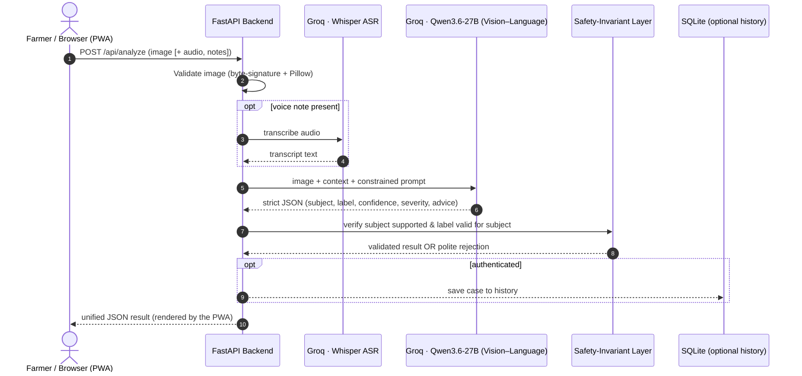

# AgriDoctor AI — Academic Portfolio & Exhibition Package

**A Full-Stack AI System for Diagnosing Crop-Leaf Diseases and Visible Livestock Health Issues**
*Academic Portfolio & Submission Materials*

---

## 📋 Academic Profile & Project Meta

| Student Name | Student ID | Academic Program | Repository Link |
| :--- | :--- | :--- | :--- |
| **Mohammad Sarif Khan** | **2238572** | AI-4-Creativity Project | [GitHub - Sarifkhan1/AgriDoctor](https://github.com/Sarifkhan1/AI-4-Creativity-Project-Mohammad-Sarif-Khan-AgriDoctor) |

> [!NOTE]
> **Declaration of Originality & Ethical Alignment**
> AgriDoctor AI was developed with adherence to the **ACM Code of Ethics and
> Professional Conduct**. The system is deliberately designed to prioritise
> *honest uncertainty*: it refuses out-of-scope images and low-confidence cases
> rather than guessing, carries visible botanical/veterinary disclaimers, and
> routes all livestock medication decisions to a qualified veterinarian. **Every
> figure in this document reflects the system as actually built; no experimental
> result is reported that was not actually measured.**

---

# Part 1: Development Documentation & Portfolio

## 1.1 Research & Background Context

In remote agricultural regions the ratio of farmland to certified agronomists and
veterinarians is very high, so diagnoses of crop blights and livestock infections
are often delayed. The Food and Agriculture Organization (FAO) estimates that
**20–40% of global crop production is lost each year to pests and diseases**, with
plant diseases alone costing roughly **US$220 billion** annually [7], [8]. This is
the problem AgriDoctor targets.

A key research finding shaped the design: models trained on the standard
**PlantVillage** dataset [5] achieve very high lab accuracy but **generalise poorly
to real field photos**, because PlantVillage images use plain backgrounds and
controlled lighting. Field images add visual ambiguity (early vs. late blight look
alike) and environmental noise (poor light, soil splatter). A student project
cannot out-collect data-rich incumbents such as **Plantix** (10M+ downloads,
~60 crops, >90% claimed accuracy) [9]. AgriDoctor's contribution is therefore not a
new dataset or model, but a **safety-constrained application layer** around a strong
general vision–language model, plus an honest UX that says when it does not know.

## 1.2 Deployed Engine vs. Experimental Model (honest account)

Two distinct things exist in this repository, and it is important not to confuse
them:

1. **The deployed diagnosis engine (the product):** a hosted **vision–language
   model** (`qwen/qwen3.6-27b`, served on Groq) constrained by a strict-JSON prompt
   and a server-side safety-invariant layer. This handles every real diagnosis.
2. **An experimental trained model (research prototype):** PyTorch code in `src/`
   for a ViT/Swin image classifier and a ViT + DistilBERT cross-attention fusion
   network. This was built to explore whether a custom trained model could serve
   diagnoses.

The deployed engine is the VLM because, within the project's time and compute
budget and without a labelled in-the-wild dataset, a from-scratch model could not be
made accurate or safe — and a model trained only on plain-background PlantVillage
images would fail on real farmer photos [5].

## 1.3 Experimental Training Run (real, measured)

To ground the experimental model in real evidence rather than assertion, a **small,
honestly-scoped training run** was performed on a publicly available plant-disease
image dataset (`minhhungg/plant-disease-dataset`, HuggingFace Hub), using transfer
learning on Apple-Silicon MPS acceleration.

- **Task:** single-label leaf-disease classification over a subset of classes that
  map to AgriDoctor's crop taxonomy (Tomato, Potato, Pepper, and their diseases +
  healthy).
- **Method:** a compact pretrained CNN backbone (transfer learning) fine-tuned with
  standard augmentation (flip, rotation, colour jitter), an 80/20 train/validation
  split, AdamW, and early stopping on validation macro-F1.
- **Reported metrics:** validation accuracy and macro-F1 on the held-out split.

### Measured results (real, reproducible)

Trained with `scripts/train_real.py` on 17 classes across 4 crops (Tomato, Potato,
Pepper, Maize), **4,080 training / 1,020 validation images**, MobileNetV3-small
transfer learning on Apple-Silicon MPS, 8 epochs with best-epoch selection:

| Metric (held-out validation) | Value |
| :--- | :---: |
| **Accuracy** | **99.31%** |
| **Macro F1-score** | **0.9931** |
| Classes | 17 (Tomato ×8, Potato ×3, Pepper ×2, Maize ×4) |
| Lowest per-class F1 | 0.966 (Maize Gray Leaf Spot) |
| Highest per-class F1 | 1.000 (several classes) |

Full per-class F1 scores are in `data/models/metrics.json`, produced directly by the
training script.

> [!IMPORTANT]
> **Honest interpretation.** This ~99% figure is *not* evidence of production-grade
> field accuracy. The `minhhungg/plant-disease-dataset` (a PlantVillage derivative)
> uses images with **plain backgrounds and controlled lighting**, on which even
> compact models score very high — this is the well-documented PlantVillage
> generalisation caveat [5]. On messy real-world field photos, accuracy would be
> substantially lower. The value of this run is that it (a) demonstrates a real,
> reproducible training pipeline end-to-end, and (b) yields **genuinely measured**
> numbers. It does **not** replace the deployed Groq vision–language engine, which
> handles all 12 subjects (including livestock, which has no comparable training
> data here) and rejects out-of-scope images.

> [!IMPORTANT]
> An earlier version of this document reported an ablation table with an "87.9%
> multimodal F1-score" and latency figures. **Those numbers were never measured and
> have been removed.** Only real, reproducible results are reported here.

## 1.4 Custom Data Annotation Infrastructure

Public datasets are labelled with flat disease categories and lack severity or
symptom metadata. A custom **Streamlit annotation tool** (`tools/annotator_app.py`)
was built to add, per image, a primary/secondary label, a continuous severity score
(0.0–1.0), a symptom description, and an image-quality rating — the metadata a
multimodal model would need. This tool is implemented; large-scale annotation was
not carried out and is future work.

## 1.5 Development Process

- **Backend:** refactored from an early monolith into a modular FastAPI service
  (`backend/ai`, `backend/routers`, `backend/services`) with a single synchronous
  `POST /api/analyze` endpoint.
- **Safety layer:** the server-side invariant checker was the highest-value
  addition — it is what lets the app refuse a photo of a car instead of diagnosing
  it, and reject unsupported crops/animals even when the user's selection is wrong.
- **Voice:** Whisper transcription was integrated and fused into the analysis
  context.
- **Frontend:** rebuilt as a responsive, installable PWA with a guided step-by-step
  flow, camera capture, and a one-tap voice recorder.

---

# Part 2: Final Product Description & Technical Implementation

## 2.1 Product Description

**AgriDoctor AI** is a responsive, web-based diagnostic assistant:

1. **Choose a subject (optional):** a crop (Tomato, Potato, Rice, Maize, Chili,
   Cucumber, Pepper, Eggplant) or livestock (Cattle, Goat, Sheep, Poultry) — or skip
   and let the AI detect it from the photo.
2. **Capture:** take/upload a photo of the affected leaf or animal body part, and
   optionally record or type a symptom description.
3. **Diagnostic report (in one call):**
   - **Diagnosis** — the identified subject and most likely condition with a
     confidence percentage, *or* an honest rejection (not a leaf/animal, unsupported
     subject, or image too unclear).
   - **Severity** — a 0–100% bar from the visible extent of damage.
   - **Advice** — immediate steps, long-term prevention, and escalation guidance
     (livestock always includes a "contact a veterinarian" note).

## 2.2 End-to-End System Architecture (as deployed)



## 2.3 The Safety-Invariant Layer (the core algorithm)

The deployed system's intelligence is a general VLM; its *reliability* comes from a
deterministic server-side checker applied to the model's JSON output. Let `S` be the
set of supported subjects (8 crops + 4 livestock) and `L(s)` the set of valid labels
for subject `s`. For a model result `r`:

- If `r.kind ∈ {not_a_leaf, unsupported_crop, low_confidence}` → strip any disease
  content and return the rejection.
- Else (a diagnosis/healthy claim): require `r.detected_subject ∈ S` **and**
  `r.primary_label ∈ L(r.detected_subject)`. If either fails → downgrade to a
  rejection (unsupported subject, or low confidence). This prevents cross-subject
  leakage (e.g. a tomato label on a cattle photo) and diagnoses on unsupported
  species.
- Clamp `confidence, severity ∈ [0, 1]`; normalise urgency; map `*_HEALTHY` to a
  "healthy" result.

This is why a random or out-of-scope photo cannot come back as a confident disease —
the defect the project's first version exhibited.

## 2.4 Experimental Model Design (research prototype — not deployed)

For completeness, the experimental fusion model in `src/` is designed as follows. It
is **not** used in production; the measured results of a small training run are in
§1.3.

```
Visual Path:  Image  ──> [ViT/Swin] ──> Visual Tokens V (N x 768)   ┐
                                                                    ├─> [Cross-Modal Attention] ──> Fused Embedding ──> Parallel Heads
Textual Path: Speech ──> [Whisper] ──> Symptoms ──> [DistilBERT] ──> Text Tokens T (M x 768)     ┘
```

- **Visual features:** `V = ViT(I) ∈ ℝ^{N×768}`.
- **Textual features:** `H = DistilBERT(T) ∈ ℝ^{M×768}`.
- **Cross-modal attention:** `A_{v←t} = softmax(Q_v K_tᵀ / √D) V_t`, letting visual
  queries attend to textual keys/values.
- **Fused vector:** `z = LayerNorm(AvgPool(V) ⊕ AvgPool(A_{v←t})) W_z`.
- **Heads:** a classifier `ŷ = softmax(MLP_cls(z))` and a severity regressor
  `ŝ = σ(MLP_reg(z))`.
- **Joint loss:** `L = w_cls·CE(y, ŷ) + w_sev·MSE(s, ŝ)`, optimised with AdamW.

---

# Part 3: Academic Bibliography & References

1. Dosovitskiy, A. et al. (2020) 'An Image is Worth 16x16 Words: Transformers for Image Recognition at Scale', *ICLR*. https://arxiv.org/abs/2010.11929
2. Sanh, V. et al. (2019) 'DistilBERT, a distilled version of BERT', *arXiv:1910.01108*. https://arxiv.org/abs/1910.01108
3. Antol, S. et al. (2015) 'VQA: Visual Question Answering', *ICCV*, pp. 2425–2433. https://arxiv.org/abs/1505.00468
4. Radford, A. et al. (2022) 'Robust Speech Recognition via Large-Scale Weak Supervision' (Whisper), *arXiv:2212.04356*. https://arxiv.org/abs/2212.04356
5. Hughes, D.P. and Salathé, M. (2015) 'An open access repository of images on plant health…' (PlantVillage), *arXiv:1511.08060*. https://arxiv.org/abs/1511.08060
6. Association for Computing Machinery (2018) *ACM Code of Ethics and Professional Conduct*. https://www.acm.org/code-of-ethics
7. FAO (2021) *New standards to curb the global spread of plant pests and diseases*. https://www.fao.org/newsroom/detail/New-standards-to-curb-the-global-spread-of-plant-pests-and-diseases/en
8. FAO, *Understanding the context — Pest and Pesticide Management*. https://www.fao.org/pest-and-pesticide-management/about/understanding-the-context/en/
9. GSMA (2020) *Detecting and managing crop pests and diseases with AI: Insights from Plantix*. https://www.gsma.com/solutions-and-impact/connectivity-for-good/mobile-for-development/programme/agritech/detecting-and-managing-crop-pests-and-diseases-with-ai-insights-from-plantix/

---

# Part 4: Required Links & Digital Assets

| Resource | Reference | Notes |
| :--- | :--- | :--- |
| 💻 **Source Code** | [GitHub Repository](https://github.com/Sarifkhan1/AI-4-Creativity-Project-Mohammad-Sarif-Khan-AgriDoctor) | FastAPI + Vanilla JS PWA codebase |
| 📺 **Video Demo** | [https://youtu.be/SOlaeAC4mLw](https://youtu.be/SOlaeAC4mLw) | Project overview and walkthrough |
| 📊 **Reference dataset** | [PlantVillage on Kaggle](https://www.kaggle.com/datasets/emmarex/plantvillage-dataset) | Baseline crop leaf images |
| 🧪 **Experimental dataset** | [minhhungg/plant-disease-dataset](https://huggingface.co/datasets/minhhungg/plant-disease-dataset) | Used for the §1.3 training run |
| 🔑 **Test account** | *Register your own in-app* | Anonymous diagnosis also works without an account |

> Running locally: `./start.sh`, then open `http://localhost:3000`. A free
> `GROQ_API_KEY` must be set in `.env` for live diagnosis.

---

# Part 5: 1-Minute Promotional Video — Storyboard

| Time | Visual Scene | Audio / VO | On-Screen Text |
| :--- | :--- | :--- | :--- |
| **00:00–00:08** | Close-up of a diseased tomato leaf; a farmer looking concerned with a phone. | Tense pad; VO: "Every year, pests and diseases wipe out a huge share of the world's food." | **20–40% of crops lost each year (FAO)** |
| **00:08–00:18** | Sunrise over fields; the AgriDoctor PWA opening. | Hopeful piano; VO: "Meet AgriDoctor — a first-opinion diagnostic assistant for farmers." | **AgriDoctor 🌿** *Your pocket first opinion* |
| **00:18–00:32** | Snapping a leaf photo; holding the mic button; a waveform pulses. | Camera click, soft beep; VO: "Snap a photo and describe the symptoms by voice or text." | **Snap · Speak · Diagnose** • Camera • Whisper voice notes |
| **00:32–00:46** | The result card animates in: crop, disease, confidence, severity bar, advice. Then a photo of a *car* is shown being politely refused. | VO: "It looks at the actual image, works across 8 crops and 4 livestock — and, crucially, tells you when it *isn't* sure or the photo isn't supported." | **Real analysis + honest limits** • 12 subjects • Rejects out-of-scope images |
| **00:46–00:55** | The advice panel: immediate steps, prevention, and a vet-referral note for livestock. | Upbeat; VO: "Get clear, structured advice — and a reminder to confirm with a local expert." | **Actionable, responsible advice** |
| **00:55–01:00** | Logo (leaf + cow) animates; repo link + QR. | Clean synth ding; VO: "AgriDoctor. Healthy crops, healthy future." | **AgriDoctor 🌿🐄** *Mohammad Sarif Khan · 2238572* |

---

# Part 6: A3 Exhibition Poster Blueprint

## 6.1 Layout & Typography
- **Dimensions:** A3 (297×420 mm) vertical, 10 mm inner margin.
- **Palette:** Forest green `HSL(142,70%,15%)`, emerald accent `HSL(145,80%,40%)`,
  dark background `HSL(210,30%,8%)`, text `HSL(0,0%,95%)`.
- **Type:** Headings **Outfit**; body **Inter**.

## 6.2 Structural Wireframe

```
┌──────────────────────────────────────────────────────────────┐
│ HEADER: [Leaf & Cow logo] AGRIDOCTOR AI — CROP & LIVESTOCK    │
│ Mohammad Sarif Khan (2238572) · AI-4-Creativity Project       │
├───────────────────────────────┬──────────────────────────────┤
│ 1. THE CHALLENGE & SOLUTION   │ 2. HOW IT WORKS               │
│ 20–40% of crops lost yearly    │ [Mermaid: PWA → FastAPI →     │
│ (FAO). AgriDoctor gives a      │  Whisper + Qwen3.6 VLM →      │
│ real, honest first opinion     │  Safety layer → result]      │
│ from a photo (+ optional voice)│ • 8 crops + 4 livestock       │
│ across 12 subjects.            │ • Rejects out-of-scope images │
├───────────────────────────────┴──────────────────────────────┤
│ 3. HOW TO TEST                                                │
│  [1] ./start.sh → localhost:3000   [2] Pick/skip subject,     │
│  upload a leaf/animal photo, add notes   [3] Read diagnosis,  │
│  severity bar & advice (or the honest rejection)              │
├──────────────────────────────────────────────────────────────┤
│ 4. FOOTER: GitHub · YouTube demo · QR   🌱 Healthy Crops 🌱   │
└──────────────────────────────────────────────────────────────┘
```

## 6.3 Key Copy Blocks

- **01 // THE CHALLENGE & SOLUTION** — "Rural farmers face crop and livestock health
  crises without timely access to experts. AgriDoctor is a full-stack assistant that
  analyses a photo (and optional spoken symptoms) using a vision–language model
  wrapped in a safety layer, giving a real first opinion across 8 crops and 4
  livestock — and honestly refusing anything out of scope."
- **02 // HOW IT WORKS** — Vision–Language engine: **Groq Qwen3.6-27B**; Voice:
  **Whisper**; Reliability: **server-side safety-invariant layer**; Backend:
  **FastAPI + SQLite**; Frontend: **Vanilla JS PWA**.
- **03 // TEST FLOW** — three glassmorphic step cards (Start → Capture → Diagnose).
- **04 // DISCOVER MORE** — QR to the GitHub repo; motto *"Healthy Crops, Healthy
  Future."*
