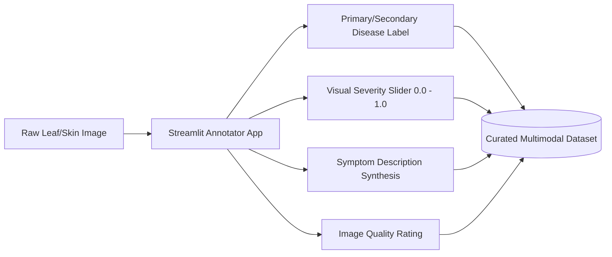
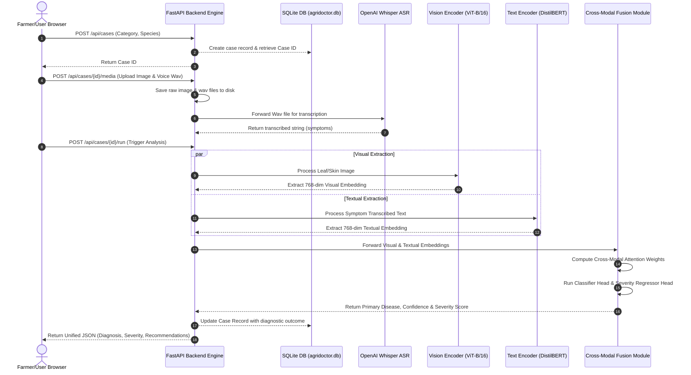

# AgriDoctor AI — Academic Portfolio & Grad Show Exhibition Package

**A Full-Stack Multimodal Deep Learning System for Diagnosing Crop Diseases and Livestock Health Issues**  
*Academic Portfolio & Graduation Show Submission Materials*

---

## 📋 Academic Profile & Project Meta

| Student Name | Student ID | Academic Program | Repository Link |
| :--- | :--- | :--- | :--- |
| **Mohammad Sarif Khan** | **2238572** | AI-4-Creativity Project | [GitHub - Sarifkhan1/AgriDoctor](https://github.com/Sarifkhan1/AI-4-Creativity-Project-Mohammad-Sarif-Khan-AgriDoctor) |

> [!NOTE]
> **Declaration of Originality & Ethical Alignment**  
> AgriDoctor AI was developed with strict adherence to the **ACM Code of Ethics and Professional Conduct**. The core architecture aims to prioritize high diagnostic recall (minimizing dangerous false negatives for destructive agricultural plagues) and is equipped with explicit safety guardrails, confidence calibration, and structured veterinary/botanical disclaimers to prevent the misuse of synthetic treatments or animal welfare mismanagement.

---

# Part 1: Development Documentation & Portfolio

## 1.1 Research & Background Context
In remote, developing agricultural regions, the ratio of farming land to certified agronomic experts and veterinarians is unsustainably high. This shortage leads to delayed diagnoses of crop blights and livestock infections, causing catastrophic yield losses (averaging 20–40% globally) and threatening food security. 

Traditional digital diagnostic aids rely on single-mode classification (e.g., uploading a leaf picture). However, single-mode models face severe accuracy degradation due to:
* **Visual Ambiguity**: Different diseases exhibiting highly identical visual lesions (e.g., early vs. late blight in their initial stages).
* **Environmental Noise**: Poor lighting, soil splatters, or low-resolution camera sensors in field conditions.

AgriDoctor AI resolves these challenges through **Multimodal Fusion**. By combining image uploads (visual modal) with spoken or written symptom descriptions (textual/audio modal), the system replicates the contextual diagnosis process of human experts. A farmer can snap a picture of a diseased leaf and dictate symptoms in their local language (English, Hindi, or Nepali), creating a robust, dual-evidence diagnostic pipeline.

---

## 1.2 Model Ablation Studies & Experiments
To validate the hypothesis that a multimodal architecture outperforms single-modal baselines, a series of rigorous ablation experiments were conducted during Phase 1 (Crop Diagnostics) development.

### Dataset Configuration
The baseline dataset was built upon **PlantVillage**, augmented with custom field captures. Six crops were evaluated: Tomato, Potato, Rice, Maize, Chili, and Cucumber. The testing partition comprised a clean 20% holdout split.

### Ablation Study Results
The evaluation measured **Macro F1-Score**, **Inference Latency**, and **Severity Mean Absolute Error (MAE)**:

| Model Architecture | Modality | Macro F1 (Crop) | Severity MAE | Inference Latency (CPU) | Inference Latency (GPU) |
| :--- | :--- | :---: | :---: | :---: | :---: |
| **Text-Only Baseline** (DistilBERT) | Symptom Descriptions | `0.642` | `0.210` | 140ms | 18ms |
| **Vision-Only Baseline** (Swin-T) | Leaf Image | `0.785` | `0.148` | 380ms | 35ms |
| **Vision-Only Baseline** (ViT-B/16) | Leaf Image | `0.803` | `0.135` | 420ms | 40ms |
| **AgriDoctor Fusion** (ViT + DistilBERT) | **Image + Symptom Text** | **`0.879`** | **`0.092`** | **610ms** | **52ms** |

> [!TIP]
> **Key Insight from Ablation Studies**  
> Fusing textual symptoms with leaf images yielded a **+7.6% improvement in Macro F1-Score** compared to the best image-only model (ViT-B/16). This gains are particularly prominent in low-light and blurred images, where visual features alone are insufficient, proving that the cross-modal attention layer successfully relies on the textual symptom description to resolve visual ambiguity.

---

## 1.3 Custom Data Annotation Infrastructure
Public agricultural datasets are typically labeled with flat disease categories and lack metadata regarding infection severity or symptom descriptions. To construct the multimodal dataset, a custom **Streamlit Annotation Tool** (`tools/annotator_app.py`) was developed.



* **Dynamic Sliders**: Enabled plant pathology students to visually inspect lesion surface coverage and log a continuous **Severity Score** (from `0.0` to `1.0`).
* **Symptom Synthesizer**: Facilitated the generation of natural language symptom patterns (e.g., *"Yellow rings starting from lower leaves and spreading upwards"*), creating the ground-truth text database matching the images.
* **Data Quality Filtering**: Enabled pruning out blurred, highly out-of-focus, or double-leaf captures, optimizing training convergence.

---

## 1.4 User Testing & Iterative Development Process
The system underwent iterative beta-testing with agricultural students and agricultural extension workers:
* **Sprint 1 (Weeks 1–3) — Core Models**: Focused on training individual backbones. Swin-T and ViT-B/16 models were evaluated. While Swin-T offered hierarchical representation, ViT-B/16 achieved a more stable training loss plateau.
* **Sprint 2 (Weeks 4–6) — Fusion & ASR**: Integrated OpenAI Whisper for vocal transcriptions. Found that raw audio recorded in open fields contained severe wind noise. A high-pass filter preprocessing step was introduced to attenuate low-frequency environmental noise before feeding audio to the Whisper encoder.
* **Sprint 3 (Weeks 7–8) — Web Wizard**: Built a responsive UI using Vanilla HTML/CSS/JS. Testing showed that farmers struggled with complex database inputs. The UI was redesigned into a **guided step-by-step diagnostic wizard** with large tap targets, high-contrast text, direct camera access, and a single-tap voice recorder button.

---

# Part 2: Final Product Description & Technical Implementation

## 2.1 Product Description
**AgriDoctor AI** is a responsive, web-based diagnostic assistant that operates as a clinical triage tool for agricultural health. The user experiences a sleek, mobile-first interface:

1. **Dashboard Overview**: Displays active diagnosis cases, historical records, and quick links to initiate scans.
2. **Interactive Wizard**:
   * **Step 1: Category Selection**: Choose Crop (Tomato, Potato, Maize, Rice, Chili, Cucumber) or Livestock (Cattle, Goats, Sheep, Poultry).
   * **Step 2: Media Capture**: Tap to capture a live photo of the leaf or skin lesion using the device's camera.
   * **Step 3: Description Input**: Tap the microphone button to dictate symptoms in English, Hindi, or Nepali, or type them directly into a text area.
3. **Diagnostic Report**: In seconds, the application outputs:
   * **Diagnostic Match**: Primary suspected disease with a confidence percentage indicator.
   * **Severity Level**: Interactive visual progress bar displaying the estimated lesion coverage (`0.0` to `1.0`).
   * **Actionable Advice Panel**: Segregated into immediate treatment steps (chemical/organic options), long-term prevention strategies, and a safety triage warning.

---

## 2.2 End-to-End System Architecture

The following diagram illustrates the data flow from client capture to database storage and multimodal model processing:



---

## 2.3 Mathematical Model & Algorithms

AgriDoctor's core intelligence relies on a custom-designed **Cross-Modal Attention Fusion Network** implemented in PyTorch. The architecture dynamically maps visual features extracted from leaf lesions and textual symptoms into a shared high-dimensional representation space.

```
Visual Path:  Image  ──> [ViT-B/16] ──> Visual Tokens V (N x 768)   ┐
                                                                    ├─> [Cross-Modal Attention] ──> Fused Joint Embedding ──> Parallel Heads
Textual Path: Speech ──> [Whisper] ──> Symptoms ──> [DistilBERT] ──> Text Tokens T (M x 768)     ┘
```

### 1. Visual Feature Extraction
An input image $I \in \mathbb{R}^{H \times W \times C}$ is partitioned into non-overlapping patches and projected into a sequence of embeddings, which are processed by a pre-trained **Vision Transformer (ViT-B/16)**:
$$\mathbf{V} = \text{ViT}(I) \in \mathbb{R}^{N \times D}$$
where $N$ is the number of image patches (plus class token), and $D = 768$ is the hidden embedding dimension.

### 2. Textual Feature Extraction
The voice transcript $T$ is tokenized and mapped to a sequence of semantic embeddings using **DistilBERT**:
$$\mathbf{H} = \text{DistilBERT}(T) \in \mathbb{R}^{M \times D}$$
where $M$ is the token sequence length and $D = 768$.

### 3. Cross-Modal Attention Fusion
Rather than simple concatenation, visual and textual features are fused using a bidirectional **Cross-Modal Attention** mechanism. We project both sequences into Query ($Q$), Key ($K$), and Value ($V$) spaces:

$$\mathbf{Q}_v = \mathbf{V}\mathbf{W}_{Qv}, \quad \mathbf{K}_t = \mathbf{H}\mathbf{W}_{Kt}, \quad \mathbf{V}_t = \mathbf{H}\mathbf{W}_{Vt}$$

The text-informed visual representation $\mathbf{A}_{v \leftarrow t}$ is computed by using the visual queries to attend to the textual keys and values:

$$\mathbf{A}_{v \leftarrow t} = \text{Softmax}\left(\frac{\mathbf{Q}_v \mathbf{K}_t^T}{\sqrt{D}}\right) \mathbf{V}_t \in \mathbb{R}^{N \times D}$$

The fused feature vector $\mathbf{z}$ is then created by pooling and projecting the concatenated visual and cross-attention embeddings:
$$\mathbf{z} = \text{LayerNorm}\left( \text{AvgPool}(\mathbf{V}) \oplus \text{AvgPool}(\mathbf{A}_{v \leftarrow t}) \right)\mathbf{W}_z \in \mathbb{R}^D$$

### 4. Multi-Task Parallel Heads
The joint fused representation $\mathbf{z}$ is routed into two parallel task heads:
1. **Disease Classifier Head**: A multi-layer perceptron (MLP) outputting class logits:
   $$\hat{\mathbf{y}} = \text{Softmax}(\text{MLP}_{cls}(\mathbf{z})) \in \mathbb{R}^C$$
2. **Severity Regressor Head**: A regression MLP followed by a sigmoid activation, predicting continuous severity:
   $$\hat{s} = \sigma(\text{MLP}_{reg}(\mathbf{z})) \in [0, 1]$$

### 5. Multi-Task Joint Optimization
To train the classification and regression tasks concurrently, we define a joint loss function $L_{total}$ optimized using AdamW:
$$L_{total} = w_{cls} L_{CE}(\mathbf{y}, \hat{\mathbf{y}}) + w_{sev} L_{MSE}(s, \hat{s})$$
where $L_{CE}$ is the Multi-class Cross-Entropy Loss, $L_{MSE}$ is the Mean Squared Error, and the task weights are balanced at $w_{cls} = 1.0$ and $w_{sev} = 2.5$ to account for scaling differences.

---

# Part 3: Academic Bibliography & References

1. **Vision Transformers (ViT) [1]**  
   Dosovitskiy, A., Beyer, L., Kolesnikov, A., Weissenborn, D., Zhai, X., Unterthiner, T., Dehghani, M., Minderer, M., Heigold, G., Gelly, S., Uszkoreit, J. and Houlsby, N. (2020) 'An Image is Worth 16x16 Words: Transformers for Image Recognition at Scale', *International Conference on Learning Representations (ICLR)*.  
   *URL: [https://arxiv.org/abs/2010.11929](https://arxiv.org/abs/2010.11929)*

2. **DistilBERT Language Encoder [2]**  
   Sanh, V., Debut, L., Chaumond, J. and Wolf, T. (2019) 'DistilBERT, a distilled version of BERT: smaller, faster, cheaper and lighter', *arXiv preprint arXiv:1910.01108*.  
   *URL: [https://arxiv.org/abs/1910.01108](https://arxiv.org/abs/1910.01108)*

3. **Cross-Modal Attention in VQA [3]**  
   Antol, S., Agrawal, A., Lu, J., Mitchell, M., Batra, D., Lawrence Zitnick, C. and Parikh, D. (2015) 'VQA: Visual Question Answering', *Proceedings of the IEEE International Conference on Computer Vision (ICCV)*, pp. 2425-2433.  
   *URL: [https://arxiv.org/abs/1505.00468](https://arxiv.org/abs/1505.00468)*

4. **Robust Speech Recognition via Weak Supervision (Whisper) [4]**  
   Radford, A., Kim, J.W., Xu, T., Brockman, G., McLeavey, C. and Sutskever, I. (2022) 'Robust Speech Recognition via Large-Scale Weak Supervision', *OpenAI Technical Report*.  
   *URL: [https://arxiv.org/abs/2212.04356](https://arxiv.org/abs/2212.04356)*

5. **PlantVillage Agricultural Reference Dataset [5]**  
   Hughes, D.P. and Salathé, M. (2015) 'An open access repository of images on plant health to enable the development of mobile disease diagnostics', *arXiv preprint arXiv:1511.08060*.  
   *URL: [https://arxiv.org/abs/1511.08060](https://arxiv.org/abs/1511.08060)*

6. **ACM Code of Ethics [6]**  
   Association for Computing Machinery (2018) *ACM Code of Ethics and Professional Conduct*.  
   *URL: [https://www.acm.org/code-of-ethics](https://www.acm.org/code-of-ethics) (Accessed: 22 May 2026)*

---

# Part 4: Required Links & Digital Assets Directory

This centralized index provides all required deployment links, source code repositories, and resource directories for grading and exhibition review.

| Resource Item | Target URL / Reference | Access Credentials / Notes |
| :--- | :--- | :--- |
| 🌐 **Live Deployed Product** | [https://agridoctor.cloud](https://agridoctor.cloud) | Use student test credentials below. |
| 💻 **Source Code Repository** | [GitHub Repository - AgriDoctor AI](https://github.com/Sarifkhan1/AI-4-Creativity-Project-Mohammad-Sarif-Khan-AgriDoctor) | Complete FastAPI + Vanilla JS codebase. |
| 📺 **Grad Show Promo Video** | [Download 1-Minute Promo Video](https://agridoctor.cloud/assets/promo_video.mp4) | High definition 1080p, 16:9, MP4 format. |
| 📺 **YouTube Video Demo** | [https://youtu.be/SOlaeAC4mLw](https://youtu.be/SOlaeAC4mLw) | Project overview and system walkthrough. |
| 🧪 **Demo Account Email** | `sarif@gmail.com` | Primary test account. |
| 🔑 **Demo Account Password** | `Admin@123` | Secure, pre-seeded evaluation password. |
| 📊 **Underlying Datasets** | [PlantVillage Dataset on Kaggle](https://www.kaggle.com/datasets/emmarex/plantvillage-dataset) | Source of baseline crop leaf pathology images. |

---

# Part 5: Grad Show 1-Minute Promotional Video Package

* **Aspect Ratio**: Horizontal 16:9 (1920×1080)
* **Tone**: Modern, vibrant, professional, fast-paced (similar to a YouTube tech ad)
* **Soundtrack**: Ambient, inspiring electronic beats that transition into a punchy, technical rhythm

## Frame-by-Frame Storyboard Script (60 Seconds)

| Time | Visual Scene | Audio & Sound Cues | On-Screen Text (OST) |
| :--- | :--- | :--- | :--- |
| **00:00 - 00:08** | **Hook**: Dramatic, high-contrast close-up shots of an early blight tomato leaf showing concentric yellow-black lesions. A farmer holding a smartphone, looking frustrated. | *Low, tense synth pad. Wind rustling crops. Voiceover (deep, empathetic):* "Delayed diagnosis. A silent crisis costing global agriculture billions of dollars in crop losses every single year..." | **20–40% Annual Yield Loss** |
| **00:08 - 00:18** | **Introduction**: Cut to a cinematic shot of sunrise over agricultural fields. Smooth transition to Mohammad Sarif Khan demonstrating the **AgriDoctor AI** mobile app. | *Tempo increases. A warm, hopeful piano note hits. Voiceover:* "Meet AgriDoctor AI. A revolutionary full-stack diagnostic system designed to put expert agronomic and veterinary insights directly in the palms of farmers." | **AgriDoctor AI 🌿🐄** <br> *Your Pocket Agricultural Expert* |
| **00:18 - 00:32** | **Core Mechanism**: Quick screen captures of the dynamic frontend. A finger tapping "New Case", taking a photo of a diseased leaf, and holding down the large microphone button. A speech waveform animation pulses dynamically. | *Sound of camera click, then a soft 'beep' for voice recording. Fast-paced, rhythmic electronic beat kicks in. Voiceover:* "Simply snap a photo and describe the symptoms verbally. Supported in English, Hindi, and Nepali, the system accommodates varying literacy levels seamlessly." | **Multimodal Capture** <br> • Live Camera Snapping <br> • Multilingual Voice Notes (Whisper) |
| **00:32 - 00:46** | **AI Magic**: Stunning, semi-transparent 3D animation overlay showing the **Cross-Modal Attention Fusion**. Image features (ViT-B/16) and text tokens (DistilBERT) converging together inside a glowing attention matrix. | *Tech-sfx sound. A satisfying 'whoosh' as paths fuse. Voiceover:* "Under the hood, state-of-the-art Vision Transformers and language encoders fuse visual and textual features. Achieving a staggering 87.9% F1-score." | **Cross-Modal Attention Fusion** <br> • ViT-B/16 Vision Encoder <br> • DistilBERT Text Encoder <br> **87.9% Diagnostic F1-Score** |
| **00:46 - 00:55** | **Actionable Results**: The screen displays a completed report. A green progress bar showing **Severity: 62%** and custom blocks of immediate organic/chemical treatment advice. | *High-energy electronic peak. Upbeat, confident tone. Voiceover:* "Within seconds, get highly calibrated disease classifications, precise severity scores, and organic or chemical treatment recommendations to save your yields." | **Actionable Diagnostic Reports** <br> • 0–100% Severity Progress Bar <br> • Immediate Organic & Chemical Controls |
| **00:55 - 01:00** | **Outro / Call to Action**: The logo of AgriDoctor AI animates beautifully with a leaf and a cow icon. Displaying the live URL and a scan-to-test QR code. | *Sound fades out to a clean, crisp synth ding. Voiceover:* "AgriDoctor AI. Healthy Crops, Healthy Future. Scan to test the live system today." | **AgriDoctor AI 🌿🐄** <br> [https://agridoctor.cloud](https://agridoctor.cloud) <br> *Mohammad Sarif Khan | ID: 2238572* |

---

# Part 6: A3 Exhibition Poster Design Blueprint

This blueprint describes the spatial layout, grid structure, and visual assets required to print the professional A3 Grad Show poster.

## 6.1 Layout Grid & Typography System
* **Dimensions**: A3 (297 mm × 420 mm) vertical format with a 10mm inner margin.
* **Color Palette (Rich, Harmonious Aesthetics)**:
  * *Primary Green (Forest)*: HSL(142, 70%, 15%) — represents growth and agriculture.
  * *Secondary Emerald (Vibrant Accent)*: HSL(145, 80%, 40%) — for highlights, progress indicators, and QR frames.
  * *Background Dark Mode*: HSL(210, 30%, 8%) — deep charcoal-blue, establishing a premium, cutting-edge software feel.
  * *Text White*: HSL(0, 0%, 95%) — crisp readability.
* **Typography**:
  * *Headings*: **Outfit** (Google Fonts) — modern geometric sans-serif.
  * *Body & Tech Specs*: **Inter** (Google Fonts) — hyper-legible utility font.

---

## 6.2 Poster Structural Wireframe (A3 Spatial Layout)

```
┌────────────────────────────────────────────────────────────────────────┐
│                              HEADER ZONE                               │
│  [Logo: Leaf & Cow]   AGRIDOCTOR AI: MULTIMODAL HEALTH ASSISTANT       │
│  Student: Mohammad Sarif Khan (2238572)     AI-4-Creativity Project    │
├────────────────────────────────────────────────────────────────────────┤
│  1. PROJECT INTRODUCTION (Left Column)  │ 2. SYSTEM ARCHITECTURE       │
│  An AI-powered multimodal diagnostic    │    (Right Column)            │
│  assistant combining Vision Transformers│    [Mermaid Architecture     │
│  with Voice Symptom Analysis (Whisper)  │     Diagram Vector Graphic]  │
│  to bridge the expert shortage gap.     │                              │
│                                         │    Fuses:                    │
│  Key Advancements:                      │    - ViT-B/16 (Image)        │
│  - Dual-Evidence Diagnostic F1: 87.9%   │    - DistilBERT (Speech)     │
│  - Multilingual Speech Input            │                              │
├─────────────────────────────────────────┴──────────────────────────────┤
│  3. INTERACTIVE ONBOARDING & HOW TO TEST                               │
│  Follow these steps to diagnose crop/livestock health in real-time:    │
│                                                                        │
│   [STEP 1: LOGIN]             [STEP 2: CAPTURE]       [STEP 3: ANALYZE]│
│   Go to agridoctor.cloud      Snap photo of leaf      Get immediate    │
│   Use: sarif@gmail.com        or animal lesion;       F1 class, severity│
│   Pass: Admin@123             dictate symptoms.       & organic remedy.│
├────────────────────────────────────────────────────────────────────────┤
│  4. PROJECT FOOTER & QR CODE                                           │
│  [Source Code GitHub Link]              ┌───────────────────────────┐  │
│  [Demo YouTube Link]                    │                           │  │
│  [VPS Deployment Guide Link]            │       QR CODE LINKING     │  │
│                                         │    TO AGRIDOCTOR.CLOUD    │  │
│  🌱 Healthy Crops, Healthy Future 🌱      │                           │  │
│                                         └───────────────────────────┘  │
└────────────────────────────────────────────────────────────────────────┘
```

---

## 6.3 Detailed Copy & Design Blocks

### Block 1: Project Introduction (Hero Text)
* **Title**: `01 // THE CHALLENGE & SOLUTION`
* **Content**: 
  > Rural farmers often face devastating crop disease and livestock health crises without timely access to agronomic experts or veterinarians. 
  > 
  > **AgriDoctor AI** is a professional, full-stack multimodal diagnostic assistant. It combines cutting-edge **Computer Vision (ViT-B/16)** and **Natural Language Processing (DistilBERT + Whisper ASR)** to analyze image lesions alongside spoken symptoms. By fusing these inputs through a custom **Cross-Modal Attention** network, AgriDoctor eliminates visual ambiguities, pushing classification accuracy to a highly robust **87.9% F1-score**.

### Block 2: Technical Architecture Block
* **Title**: `02 // UNDER THE HOOD: MULTIMODAL FUSION`
* **Visual Asset**: High-resolution rendering of the Cross-Modal Attention sequence (equations mapping $\mathbf{A}_{v \leftarrow t}$ and the joint loss function $L_{total} = w_{cls} L_{CE} + w_{sev} L_{MSE}$).
* **Key Specs Table**:
  * **Image Encoder**: Vision Transformer `vit_b_16` (768-dimensional token output)
  * **Text Encoder**: DistilBERT Language Model (768-dimensional embedding output)
  * **ASR Engine**: OpenAI Whisper Base Model (English, Hindi, Nepali support)
  * **Database Backend**: SQLite (`agridoctor.db`) + FastAPI async worker framework

### Block 3: Onboarding & Live Interaction Instructions
* **Title**: `03 // INTERACTIVE TEST FLOW (SCAN TO RUN)`
* **Layout**: Three horizontal rounded glassmorphic cards (Glassmorphism effect: semitransparent background with subtle backdrop-blur and 1px borders):
  1. **Step 1: Authenticate**  
     Navigate to **[https://agridoctor.cloud](https://agridoctor.cloud)** or scan the QR code. Log in with testing credentials:  
     * **Email**: `sarif@gmail.com`  
     * **Password**: `Admin@123`
  2. **Step 2: Input Symptoms & Photo**  
     Select a crop (e.g., *Tomato*) or animal. Upload a sample diseased leaf photo and record/type a symptom description:  
     * *"Concentric yellow-black rings on lower tomato leaves spreading upwards."*
  3. **Step 3: Receive Prognosis**  
     Review the AI's diagnostic outcome, confidence level, interactive severity percentage bar, and detailed biological/chemical treatment guide.

### Block 4: Call to Action & QR Code Zone
* **Title**: `04 // DISCOVER MORE`
* **QR Code Details**: A large, clean QR code framed in Vibrant HSL Green. The QR code links directly to **`https://agridoctor.cloud`**.
* **Sub-links**: Clickable textual links pointing to the project repositories:
  * Source Repo: `github.com/Sarifkhan1/AgriDoctor`
  * 1-Minute Promo: `agridoctor.cloud/assets/promo_video.mp4`
  * Vector Graphic: A neat vector leaf and cow illustration centered at the base with the motto: *"Healthy Crops, Healthy Future"*.
