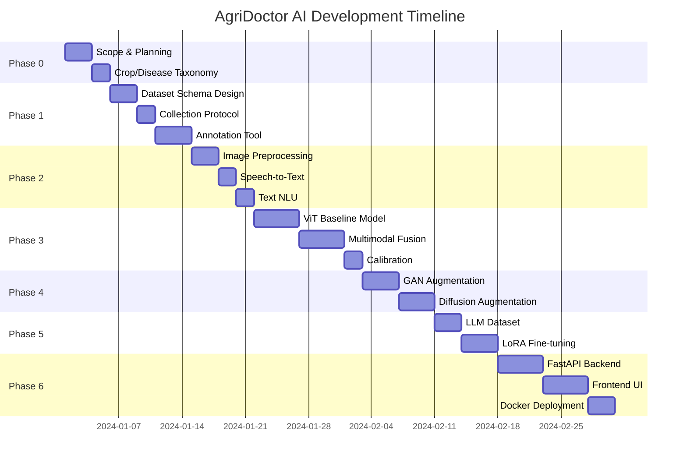

# AgriDoctor AI - Project Scope & MVP Definition

## Executive Summary

AgriDoctor AI is a multimodal agricultural health assistant that helps farmers diagnose crop diseases and livestock health issues using images, voice notes, and text inputs.

---

## MVP Scope (Crop Only) - 6 Weeks

### Core Features

| Feature                      | Description                                          | Priority |
| ---------------------------- | ---------------------------------------------------- | -------- |
| **Disease Classification**   | Multi-label crop disease detection from leaf images  | P0       |
| **Severity Assessment**      | 0-1 severity scoring based on lesion coverage        | P0       |
| **Explanation Generation**   | LLM-powered safe guidance for farmers                | P0       |
| **Voice Note Transcription** | Farmer voice notes → structured symptom extraction   | P1       |
| **Image + Text Fusion**      | Multimodal model combining visual + textual evidence | P1       |

### Supported Crops (Phase 1)

1. **Tomato** - Early blight, Late blight, Leaf mold, Septoria spot, Spider mites, Mosaic virus, Healthy
2. **Potato** - Early blight, Late blight, Blackleg, Scab, Healthy
3. **Rice** - Blast, Brown spot, Bacterial blight, Tungro, Healthy
4. **Maize** - Northern leaf blight, Common rust, Gray leaf spot, Healthy
5. **Chili** - Anthracnose, Bacterial wilt, Leaf curl, Healthy
6. **Cucumber** - Powdery mildew, Downy mildew, Angular leaf spot, Mosaic, Healthy

### MVP Success Criteria

- [ ] End-to-end flow works on local + deployed
- [ ] Demo works on mobile browser
- [ ] F1-score ≥ 0.75 on test set
- [ ] Inference latency < 300ms (GPU) / < 2s (CPU)
- [ ] Voice transcription accuracy ≥ 85%

---

## V1 Scope (Add Livestock) - 4 Additional Weeks

### Additional Features

| Feature                      | Description                                | Priority |
| ---------------------------- | ------------------------------------------ | -------- |
| **Livestock Audio Analysis** | Cough/breath audio classification          | P0       |
| **Animal Triage**            | Urgency assessment for veterinary referral | P0       |
| **Multi-Animal Support**     | Cattle, Poultry, Goats/Sheep               | P1       |
| **Case History Timeline**    | Track multiple encounters per case         | P2       |

### V1 Success Criteria

- [ ] Audio classification AUC ≥ 0.80
- [ ] Triage accuracy ≥ 70%
- [ ] Handles 50+ concurrent users
- [ ] User satisfaction score ≥ 4.0/5.0

---

## Timeline (10 Weeks Total)

---

## Risk Matrix

| Risk                                         | Likelihood | Impact   | Mitigation                                         |
| -------------------------------------------- | ---------- | -------- | -------------------------------------------------- |
| Insufficient training data for rare diseases | High       | High     | GAN/Diffusion augmentation, transfer learning      |
| Voice notes in multiple languages/dialects   | Medium     | Medium   | Multi-language ASR, language ID fallback           |
| LLM generates unsafe medical advice          | Medium     | Critical | Safety guardrails, refusal templates, human review |
| High inference latency on mobile             | Medium     | Medium   | Model quantization, edge deployment option         |
| Farmer adoption resistance                   | Low        | High     | Mobile-first UX, voice-first interface             |

---

## Success Metrics Dashboard

### Model Performance

| Metric                  | MVP Target | V1 Target |
| ----------------------- | ---------- | --------- |
| Macro F1 (Crop Disease) | ≥ 0.75     | ≥ 0.82    |
| Severity MAE            | ≤ 0.15     | ≤ 0.10    |
| ECE (Calibration)       | ≤ 0.10     | ≤ 0.08    |
| Audio AUC (Livestock)   | -          | ≥ 0.80    |

### System Performance

| Metric            | MVP Target | V1 Target |
| ----------------- | ---------- | --------- |
| API Latency (p95) | < 500ms    | < 300ms   |
| Uptime            | 99%        | 99.9%     |
| Concurrent Users  | 10         | 50+       |

### User Experience

| Metric            | MVP Target | V1 Target |
| ----------------- | ---------- | --------- |
| Lighthouse Score  | ≥ 70       | ≥ 85      |
| Mobile Usability  | Works      | Excellent |
| User Satisfaction | -          | ≥ 4.0/5   |
