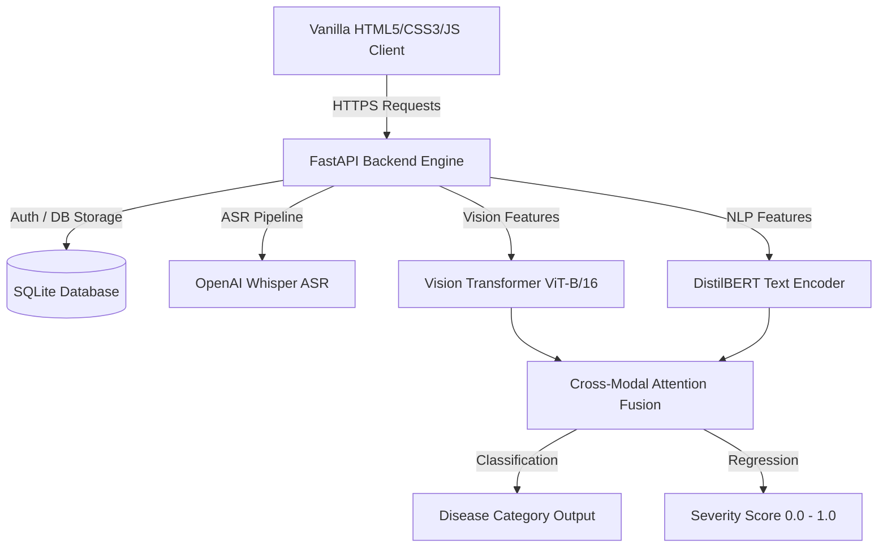

# AgriDoctor AI — Project Reference Manual

> **An AI-Powered Multimodal Agricultural Health Assistant for Diagnosing Crop Diseases and Livestock Health Issues**
> Developed by: **Mohammad Sarif Khan** (Student ID: 2238572)

---

## 🌿 Project Overview

**AgriDoctor AI** is a comprehensive, full-stack multimodal artificial intelligence system designed to help farmers and agricultural professionals diagnose crop diseases and livestock health issues. 

By combining **Computer Vision** (for analyzing leaf and skin images) with **Natural Language Processing / Automatic Speech Recognition** (for extracting symptoms from verbal descriptions), AgriDoctor AI provides a robust, multi-layered diagnostic system. It translates complex agronomic/veterinary disease signatures into actionable treatment advice, severity assessments, and prevention strategies.

---

## 📊 Project Scope

The project is structured in two major phases to balance depth and breadth of features:

### Phase 1: Crop Diagnosis (MVP Scope)
- **Supported Crops**: Tomato, Potato, Rice, Maize, Chili, and Cucumber.
- **Diagnostics**: Multi-label classification of leaf diseases (e.g., Early Blight, Late Blight, Anthracnose, Powdery Mildew).
- **Severity Estimation**: A unified regression head outputting a severity score (`0.0` to `1.0`) based on lesion surface coverage.
- **Multimodal Fusion**: Fuses visual embeddings and textual descriptions to increase diagnostic accuracy compared to image-only baseline models.

### Phase 2: Livestock Diagnosis (V1 Scope)
- **Supported Livestock**: Cattle, Goats, Sheep, and Poultry.
- **Diagnostics**: Health issues such as Foot and Mouth Disease, Mastitis, parasites, and respiratory conditions.
- **Urgency Triage**: Veterinary triage level estimation (Low, Medium, High urgency).

---

## ✨ Key Features

| Feature | Description |
| :--- | :--- |
| 🖼️ **Multimodal Inputs** | Accept crop/animal photos along with written or spoken symptoms for high-accuracy analysis. |
| 🎤 **ASR (Voice Recognition)** | Utilizes **OpenAI Whisper** to transcribe spoken symptoms in English, Hindi, and Nepali. |
| 🧠 **Cross-Modal Attention** | Fuses image features from **Vision Transformers (ViT)** with symptom tokens from **DistilBERT**. |
| 💡 **Structured Treatment Advice** | Provides a step-by-step immediate treatment plan, organic/chemical controls, and long-term prevention guidelines. |
| 🔒 **Secure Case Management** | JWT-based auth with secure PBKDF2 password hashing to save and track historic diagnosis records. |
| 🛠️ **Data Annotation Tool** | Streamlit-based utility (`tools/annotator_app.py`) for expert labeling of crop/animal dataset images and severity levels. |

---

## 🛠️ Technology Stack

### Frontend
- **Core**: Vanilla HTML5, CSS3, JavaScript (mobile-first, responsive wizard).
- **APIs**: MediaDevices API (Camera capture) and MediaRecorder API (Voice note capture).

### Backend & AI Infrastructure
- **Web Framework**: FastAPI (Python 3.11+) served via Uvicorn.
- **Database**: SQLite (managed with `sqlite3` context managers in Python).
- **Deep Learning**: PyTorch & TorchVision (`vit_b_16` / Swin Transformers).
- **NLP**: Hugging Face Transformers (`DistilBERT` model).
- **ASR**: OpenAI Whisper (transcription of wav/mp3 audio files).
- **Deployment**: Docker, Docker Compose, and Nginx reverse proxy.

---

## ⚙️ How it Works (Under the Hood)

1. **Case Creation**: The user initiates a diagnosis wizard, choosing the category (Crop/Livestock) and specific crop or animal species.
2. **Media Capture**: The user snaps a leaf/skin photo and records a short voice note describing when the symptoms started and how quickly they are spreading.
3. **API Processing**:
   - The image is saved to `data/uploads/images/`.
   - The voice recording is saved to `data/uploads/speech/` and processed via OpenAI Whisper to generate text.
   - Text symptoms are passed through a Natural Language Understanding (NLU) module to extract entities.
4. **Multimodal Fusion Pipeline**:
   - The **ViT Image Encoder** extracts a 768-dimensional visual feature vector.
   - The **DistilBERT Text Encoder** extracts a 768-dimensional textual feature representation.
   - The **Cross-Modal Attention Fusion Layer** aligns visual and textual tokens, outputting fused feature representations.
   - The joint representation is fed to parallel classification (disease label) and regression (severity score) heads.
5. **UI Rendering**: The API returns a unified JSON output containing the primary diagnosis, confidence level, severity estimation, and structured treatment advice. The frontend displays this in an intuitive, responsive dashboard.

---

## 🧪 Sample Test Instructions

Instructors can test the app on the live server using these steps:

1. **Login** to the application using the credentials:
   - **Email**: `sarif@gmail.com`
   - **Password**: `Admin@123`
2. **Click "New Case"** on the dashboard.
3. **Select a Crop** (e.g., **Tomato**).
4. **Upload a Sample Leaf Image** from the list below:
   * **Tomato Early Blight Leaf**: [Download Image](https://upload.wikimedia.org/wikipedia/commons/5/52/Alternaria_solani_01.jpg)
   * **Potato Late Blight Leaf**: [Download Image](https://upload.wikimedia.org/wikipedia/commons/a/ae/Late_blight_on_potato_leaf.jpg)
   * **Rice Blast Leaf**: [Download Image](https://upload.wikimedia.org/wikipedia/commons/0/07/Rice_blast_symptoms_on_leaves.jpg)
5. **Describe symptoms**: Write or record a sample description, such as:
   > *"I noticed dark spots with concentric rings on the lower tomato leaves. The spots have yellow margins and seem to be spreading upwards."*
6. **Submit for Analysis**: Review the generated diagnosis, confidence indicators, severity progress bar, and treatment recommendations.
