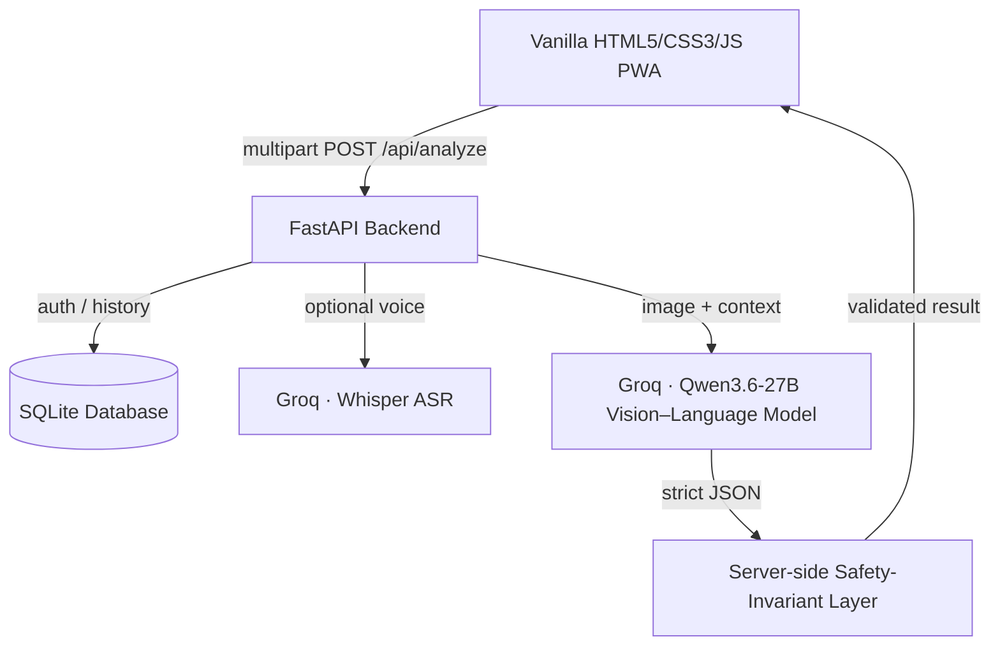

# AgriDoctor AI — Project Reference Manual

> **An AI-powered assistant for diagnosing crop-leaf diseases and visible livestock
> health issues from a photo, with optional voice input.**
> Developed by: **Mohammad Sarif Khan** (Student ID: 2238572)

---

## 🌿 Project Overview

**AgriDoctor AI** is a full-stack web application that helps farmers diagnose
crop-leaf diseases and visible livestock health issues from a photograph, with an
optional spoken or typed symptom description.

The diagnosis engine is a **hosted vision–language model** (`qwen/qwen3.6-27b`,
served on Groq), wrapped in a **server-side safety layer** that is the core
contribution of the project. The model's output is never trusted blindly: the
server independently verifies that a diagnosis is only produced for a supported
subject with a valid label, and converts anything else (a non-leaf/non-animal
photo, an unsupported crop or animal, an unusable image) into an honest rejection
rather than a fabricated result. Optional voice input is transcribed with
**Whisper** and fused into the analysis.

> **Honesty note:** every diagnosis is generated at run time from the uploaded
> image. There are no hard-coded or mock predictions.

---

## 📊 Project Scope

### Supported subjects (implemented and working)

- **Crops (8):** Tomato, Potato, Rice, Maize, Chili, Cucumber, Pepper, Eggplant —
  leaf/plant disease diagnosis.
- **Livestock (4):** Cattle, Goat, Sheep, Poultry — *visible* health issues (e.g.
  Foot-and-Mouth, Lumpy Skin, Mastitis, Orf, Mange, Footrot, Fowlpox). Livestock
  advice always directs the farmer to a qualified veterinarian for medication.
- **~91 total condition labels** across fungal, bacterial, viral, pest, parasitic,
  nutrient, and healthy categories (see `data/taxonomy.json`).
- **Severity & urgency:** each diagnosis includes a severity score (0.0–1.0) and an
  urgency level (low/medium/high), produced by the vision model from visible extent
  of damage and any farmer-supplied context.

### Not implemented (honest future work)

- A custom *trained* neural network serving predictions (see "Experimental model"
  below — the code exists but is a research prototype).
- Additional crops/animals beyond the 12 above; other livestock conditions that are
  not visually diagnosable from a single photo.

---

## ✨ Key Features

| Feature | Description |
| :--- | :--- |
| 🖼️ **Real image diagnosis** | Every photo is analysed at run time by a vision–language model — no mock predictions. |
| 🚫 **Out-of-scope rejection** | Non-leaf/non-animal images, unsupported crops/animals, and unusable photos are refused, not force-fit. |
| 🎤 **Voice input (ASR)** | Uses **Whisper** on Groq to transcribe spoken symptoms; the transcript is fused into the diagnosis. |
| 💡 **Structured advice** | Immediate treatment steps, long-term prevention, and escalation guidance (vet referral for livestock). |
| 🔒 **Optional accounts** | JWT auth with PBKDF2 hashing; login only gates saved history — anonymous diagnosis works too. |
| 🛠️ **Data annotation tool** | Streamlit utility (`tools/annotator_app.py`) built to label images for the experimental training pipeline. |

---

## 🛠️ Technology Stack

### Frontend
- **Core:** Vanilla HTML5, CSS3, JavaScript (mobile-first, installable PWA).
- **APIs:** MediaDevices (camera capture) and MediaRecorder (voice capture).

### Backend & AI (serving)
- **Web framework:** FastAPI (Python 3.11+) via Uvicorn.
- **Diagnosis engine:** Groq-hosted `qwen/qwen3.6-27b` (vision), `whisper-large-v3-turbo`
  (voice), `llama-3.3-70b-versatile` (advice text on the optional local-CNN path).
- **Database:** SQLite with automatic schema migration.
- **Deployment:** Docker, Docker Compose, Nginx.

### Experimental / offline only (in `src/`, NOT used at serving time)
- **PyTorch / TorchVision:** a ViT/Swin image classifier and a ViT + DistilBERT
  cross-attention fusion architecture. This is a **research prototype** — see the
  dedicated section below.

---

## ⚙️ How it Works (Under the Hood)

1. **Subject selection (optional):** the user picks a crop or animal, or skips it —
   the AI identifies the subject from the photo regardless.
2. **Media capture:** the user takes a leaf/skin photo and optionally records a
   short voice note about onset and spread.
3. **API processing (`POST /api/analyze`):**
   - The image is validated (byte-signature + Pillow) and, if the user is logged in,
     saved under `data/uploads/images/`.
   - Any voice note is transcribed via Whisper and its text added to the context.
4. **Vision–language diagnosis:** the image + context are sent to the Groq vision
   model with a constrained prompt that forces a strict-JSON result and a label from
   the controlled taxonomy.
5. **Safety-invariant layer:** the server verifies the detected subject is supported
   and the label belongs to it; otherwise it returns a polite rejection. Confidence
   and severity are clamped; cross-subject or hallucinated labels are stripped.
6. **UI rendering:** the API returns one JSON object (diagnosis, confidence,
   severity, structured advice, or a rejection message) which the frontend renders.

---

## 🔬 Experimental Model (research prototype — not deployed)

The repository includes PyTorch code for a custom trained model
(`src/models/train_image_model.py`, `train_multimodal.py`) — a ViT/Swin image
classifier and a ViT + DistilBERT cross-attention fusion network with disease and
severity heads. **Status: the code is implemented but the model is trained only as a
small offline proof-of-concept (see the Submission Materials for the real, measured
numbers); it does not serve production diagnoses.** The deployed engine is the
hosted vision–language model above. If a trained checkpoint is placed at
`data/models/best_model.pt` and `USE_LOCAL_CNN=True`, the analyzer will try it first
and fall back to the hosted model on low confidence.

---

## 🧪 Sample Test Instructions

Run locally (no account required for diagnosis):

1. Start the app: `./start.sh` (backend :8000, frontend :3000), then open
   **http://localhost:3000**.
2. Click **Diagnose**. Optionally pick a crop/animal, or skip to auto-detect.
3. Upload a sample image, e.g.:
   - **Tomato Early Blight (Alternaria solani):** https://commons.wikimedia.org/wiki/File:Alternaria_solani_-_leaf_lesions.jpg
   - **Potato leaves:** https://commons.wikimedia.org/wiki/File:Potato_leaves.jpg
   - A photo that is **not** a supported crop/animal (e.g. a grape leaf or a pig) to
     see the out-of-scope rejection.
4. Optionally add a symptom note, e.g. *"dark spots with concentric rings on the
   lower leaves, spreading upwards."*
5. Submit and review the diagnosis, confidence, severity bar, and advice.

> Diagnosis requires a free `GROQ_API_KEY` in `.env`. The first analysis can take
> 5–40 s and the free tier allows ~one image per minute (a clear "AI is busy"
> message appears if you exceed it).
